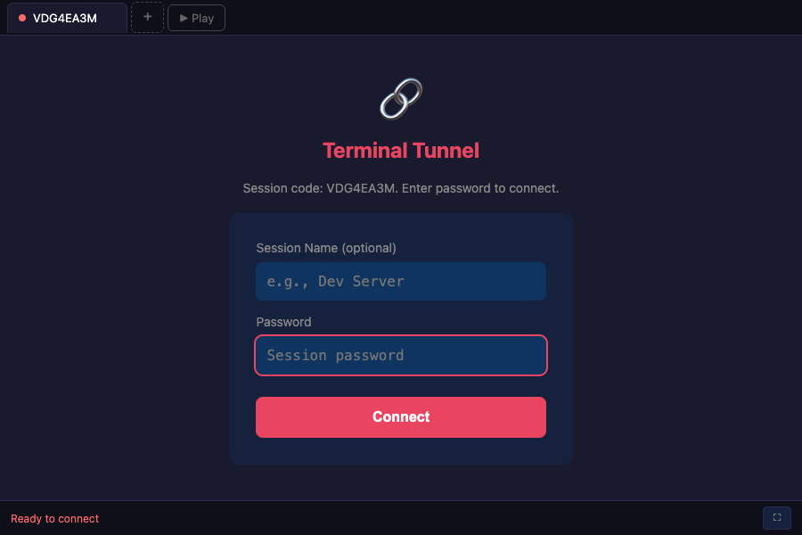

# Terminal Tunnel

[](https://github.com/artpar/terminal-tunnel/actions/workflows/build.yml)
[](https://github.com/artpar/terminal-tunnel/actions/workflows/api-tests.yml)
[](https://github.com/artpar/terminal-tunnel/releases/latest)
[](https://opensource.org/licenses/MIT)

P2P terminal sharing with end-to-end encryption. Share your terminal from anywhere - no signup, no relay servers, just direct encrypted connections.

**[Web Client](https://artpar.github.io/terminal-tunnel/)** | **[Releases](https://github.com/artpar/terminal-tunnel/releases/latest)** | **[API Docs](examples/courier-collection/)**



## Table of Contents

- [Install](#install)
- [Quick Start](#quick-start)
- [Features](#features)
- [Command Reference](#command-reference)
- [Usage Examples](#usage-examples)
- [Session Recording](#session-recording)
- [Architecture](#architecture)
- [Security](#security)
- [NAT Traversal](#nat-traversal)
- [Self-Hosting](#self-hosting)
- [Development](#development)
- [Contributing](#contributing)

## Install

### One-liner (macOS/Linux)

```bash
# macOS (Apple Silicon)
curl -L https://github.com/artpar/terminal-tunnel/releases/latest/download/tt-darwin-arm64.tar.gz | tar xz && sudo mv tt /usr/local/bin/

# macOS (Intel)
curl -L https://github.com/artpar/terminal-tunnel/releases/latest/download/tt-darwin-amd64.tar.gz | tar xz && sudo mv tt /usr/local/bin/

# Linux (x64)
curl -L https://github.com/artpar/terminal-tunnel/releases/latest/download/tt-linux-amd64.tar.gz | tar xz && sudo mv tt /usr/local/bin/

# Linux (ARM64)
curl -L https://github.com/artpar/terminal-tunnel/releases/latest/download/tt-linux-arm64.tar.gz | tar xz && sudo mv tt /usr/local/bin/
```

### Package Managers

<details>
<summary><b>Homebrew (macOS/Linux)</b></summary>

```bash
brew install artpar/tap/tt
```
</details>

<details>
<summary><b>Scoop (Windows)</b></summary>

```powershell
scoop bucket add artpar https://github.com/artpar/scoop-bucket
scoop install terminal-tunnel
```
</details>

<details>
<summary><b>Chocolatey (Windows)</b></summary>

```powershell
choco install terminal-tunnel
```
</details>

<details>
<summary><b>AUR (Arch Linux)</b></summary>

```bash
yay -S terminal-tunnel-bin
# or: paru -S terminal-tunnel-bin
```
</details>

<details>
<summary><b>Snap (Linux)</b></summary>

```bash
sudo snap install terminal-tunnel
```
</details>

<details>
<summary><b>Nix</b></summary>

```bash
nix run github:artpar/terminal-tunnel
# or install: nix profile install github:artpar/terminal-tunnel
```
</details>

<details>
<summary><b>APT (Debian/Ubuntu)</b></summary>

```bash
echo "deb [trusted=yes] https://artpar.github.io/apt-repo stable main" | sudo tee /etc/apt/sources.list.d/terminal-tunnel.list
sudo apt update && sudo apt install terminal-tunnel
```
</details>

<details>
<summary><b>RPM (Fedora/RHEL)</b></summary>

```bash
curl -LO https://github.com/artpar/terminal-tunnel/releases/latest/download/tt-1.4.1.x86_64.rpm
sudo rpm -i tt-1.4.1.x86_64.rpm
```
</details>

<details>
<summary><b>Go</b></summary>

```bash
go install github.com/artpar/terminal-tunnel/cmd/terminal-tunnel@latest
```
</details>

### All Platforms

| Platform | Architectures | Formats |
|----------|---------------|---------|
| Linux | amd64, arm64, armv7 | tar.gz, .deb, .rpm, .apk, Snap, Nix |
| macOS | amd64, arm64 | tar.gz, Homebrew, Nix |
| Windows | amd64, arm64 | .zip, Scoop, Chocolatey |
| FreeBSD | amd64 | tar.gz |

See [Releases](https://github.com/artpar/terminal-tunnel/releases/latest) for all downloads.

## Quick Start

```bash
# Simple: share your terminal instantly
tt start -p mypassword

# Output:
# Session started:
#   Code:     XYZ789
#   Password: mypassword
#   URL:      https://artpar.github.io/terminal-tunnel/?c=XYZ789
#
# Share the URL and password. Press Ctrl+C to end.
```

Open the URL in any browser, enter the password, and you're connected!

### Daemon Mode (Multiple Sessions)

```bash
# Start daemon (background service)
tt daemon start

# Start sessions (runs in background)
tt start -d -p session1
tt start -d -p session2

# Manage sessions
tt list              # List all sessions
tt status            # Show daemon status
tt stop XYZ789       # Stop a session
tt daemon stop       # Stop daemon and all sessions
```

## Features

| Feature | Description |
|---------|-------------|
| **Zero setup** | Single binary, no dependencies, no signup |
| **End-to-end encrypted** | Password-derived keys (Argon2id + NaCl SecretBox) |
| **Fully P2P** | Direct WebRTC connection, data never touches servers |
| **Cross-NAT** | Works across networks (STUN/TURN/ICE) |
| **Mobile friendly** | Access from any device with a browser |
| **Session recording** | Record and replay sessions (asciicast format) |
| **Public viewer mode** | Share read-only view without password |
| **Multi-session** | Run multiple concurrent sessions via daemon |
| **Cross-platform** | Linux, macOS, Windows, FreeBSD |

## Command Reference

```
tt - Terminal Tunnel CLI

COMMANDS:
  tt start [flags]       Start a new terminal session
  tt stop <code>         Stop a session
  tt list                List all sessions
  tt status              Show daemon and session status
  tt daemon start        Start background daemon
  tt daemon stop         Stop daemon (ends all sessions)
  tt relay               Run a signaling relay server
  tt recordings          List recorded sessions
  tt play <file>         Play back a recorded session

FLAGS FOR 'tt start':
  -p, --password <pwd>   Session password (auto-generated if omitted)
  -s, --shell <path>     Shell to run (default: $SHELL)
  -d, --detach           Run in background via daemon
  --record               Record session to ~/.tt/recordings/
  --public               Enable read-only public viewer mode
  --no-turn              Disable TURN relay (P2P only)

FLAGS FOR 'tt relay':
  --port <int>           Port to listen on (default: 8765)

FLAGS FOR 'tt play':
  --speed <float>        Playback speed multiplier (default: 1.0)

EXAMPLES:
  tt start -p secret                    # Interactive session
  tt start -d -p secret --record        # Background + recording
  tt start --public                     # With public viewer link
  tt relay --port 8080                  # Self-hosted relay
  tt play recording.cast --speed 2      # 2x playback
```

## Usage Examples

### Basic Terminal Sharing

```bash
# Start an interactive session
tt start -p mypassword

# You'll see:
# Session started:
#   Code:     ABC123
#   Password: mypassword
#   URL:      https://artpar.github.io/terminal-tunnel/?c=ABC123
#
# Press Ctrl+C to end session

# Share the URL and password with your collaborator
# They open the URL, enter the password, and see your terminal
```

### Background Sessions (Daemon Mode)

```bash
# Start the daemon
tt daemon start

# Create multiple sessions
tt start -d -p dev-session
tt start -d -p demo-session
tt start -d -p support-session

# Check status
tt list
# CODE      STATUS     SHELL      CREATED
# ABC123    waiting    /bin/zsh   just now
# DEF456    connected  /bin/zsh   2 mins ago
# GHI789    waiting    /bin/zsh   5 mins ago

tt status
# Daemon: running (PID 12345, uptime 10m)
# Sessions: 3 total, 1 connected

# Stop specific session
tt stop ABC123

# Stop everything
tt daemon stop
```

### Recording Sessions

```bash
# Record a session
tt start -p mypassword --record

# Session is saved to ~/.tt/recordings/

# List recordings
tt recordings
# 2024-01-15_10-30-00_ABC123.cast  (2.5 MB, 15 mins)
# 2024-01-14_14-00-00_XYZ789.cast  (1.2 MB, 8 mins)

# Playback
tt play ~/.tt/recordings/2024-01-15_10-30-00_ABC123.cast

# Fast playback
tt play recording.cast --speed 2
```

### Public Viewer Mode

```bash
# Start session with public viewer link
tt start -p mypassword --public

# Output includes both:
#   Control URL: https://.../?c=ABC123 (requires password)
#   Viewer URL:  https://.../?c=ABC123V (read-only, no password)

# Share viewer URL for read-only access (demos, presentations)
```

## Session Recording

Sessions can be recorded in [asciicast v2](https://github.com/asciinema/asciinema/blob/master/doc/asciicast-v2.md) format, compatible with [asciinema](https://asciinema.org/).

```bash
# Record during session
tt start --record -p mypassword

# Recordings saved to
~/.tt/recordings/YYYY-MM-DD_HH-MM-SS_CODE.cast

# Play with tt
tt play recording.cast

# Or with asciinema
asciinema play recording.cast

# Upload to asciinema.org
asciinema upload recording.cast
```

## Architecture

```
┌─────────────────────────────────────────────────────────────┐
│  HOST (your machine)                                        │
│  tt start -p password                                       │
├─────────────────────────────────────────────────────────────┤
│  ┌─────────────┐    ┌─────────────┐    ┌─────────────┐     │
│  │    PTY      │───▶│   WebRTC    │───▶│  Encryption │     │
│  │  (shell)    │    │ DataChannel │    │  (NaCl Box) │     │
│  └─────────────┘    └─────────────┘    └─────────────┘     │
└─────────────────────────────────────────────────────────────┘
                              │
                              │ P2P Connection (encrypted)
                              │
┌─────────────────────────────────────────────────────────────┐
│  CLIENT (browser)                                           │
│  https://artpar.github.io/terminal-tunnel/?c=CODE           │
├─────────────────────────────────────────────────────────────┤
│  ┌─────────────┐    ┌─────────────┐    ┌─────────────┐     │
│  │  xterm.js   │◀───│   WebRTC    │◀───│  Decryption │     │
│  │ (terminal)  │    │ DataChannel │    │  (NaCl Box) │     │
│  └─────────────┘    └─────────────┘    └─────────────┘     │
└─────────────────────────────────────────────────────────────┘
```

### Data Flow

1. **Host** generates session code, derives encryption key from password
2. **Signaling** exchanges connection info via relay (only metadata, ~2KB)
3. **P2P Connection** established directly between host and client
4. **All terminal I/O** encrypted end-to-end, never touches relay

### State Directory

```
~/.tt/
├── tt.pid              # Daemon PID
├── tt.sock             # Unix socket for IPC
├── sessions/           # Active session state
│   └── ABC123.json
└── recordings/         # Recorded sessions
    └── 2024-01-15_10-30-00_ABC123.cast
```

## Security

### Encryption Layers

| Layer | Method | Purpose |
|-------|--------|---------|
| Transport | WebRTC DTLS | Encrypted connection |
| Application | NaCl SecretBox | E2E encryption on top |
| Key Derivation | Argon2id | Password → 256-bit key |

### What's Protected

- All terminal I/O encrypted end-to-end
- Password never transmitted (key derived locally)
- Relay only sees encrypted signaling metadata
- Session codes expire in 24 hours

### Relay Server Data

| Data | Stored | Impact if Leaked |
|------|--------|------------------|
| Session code | Yes | Random, expires quickly |
| SDP offer/answer | Yes | Connection metadata only |
| Salt | Yes | Useless without password |
| Password | **No** | Never transmitted |
| Terminal I/O | **No** | Direct P2P |

## NAT Traversal

| NAT Type | Method | Success Rate |
|----------|--------|--------------|
| Open/Full Cone | STUN | ~100% |
| Restricted Cone | STUN + ICE | ~95% |
| Port Restricted | STUN + ICE | ~90% |
| Symmetric | TURN required | ~100% with TURN |

### TURN Configuration (for corporate networks)

```bash
export TURN_URL="turn:your-server.com:3478"
export TURN_USERNAME="user"
export TURN_PASSWORD="pass"
tt start -p mypassword
```

## Self-Hosting

### Environment Variables

| Variable | Default | Description |
|----------|---------|-------------|
| `TT_RELAY_URL` | `https://terminal-tunnel-relay.artpar.workers.dev` | Relay server |
| `TT_CLIENT_URL` | `https://artpar.github.io/terminal-tunnel` | Web client |

### Self-Hosted Relay

```bash
# Option 1: Built-in relay server
tt relay --port 8765

# Option 2: Cloudflare Worker (see relay-worker/)
cd relay-worker
wrangler deploy
```

### Self-Hosted Web Client

1. Fork this repo
2. Enable GitHub Pages (Settings → Pages → main/docs)
3. Access at `https://yourusername.github.io/terminal-tunnel`

## Development

### Prerequisites

- Go 1.21+
- Node.js 18+ (for API tests)

### Build & Test

```bash
# Build
make build

# Run Go tests
make test

# Run API tests (requires Bruno CLI)
npm install -g @usebruno/cli
make test-api

# Build all platforms
make build-all

# Install locally
make install
```

### Project Structure

```
terminal-tunnel/
├── cmd/terminal-tunnel/    # CLI entry point
├── internal/
│   ├── daemon/             # Background service
│   ├── session/            # Session management
│   ├── signaling/          # WebRTC signaling
│   └── server/             # HTTP/WebSocket server
├── docs/                   # Web client (GitHub Pages)
├── relay-worker/           # Cloudflare Worker relay
├── examples/
│   └── courier-collection/ # API test collection
└── services/               # Systemd/launchd configs
```

### Running as a Service

<details>
<summary><b>Linux (systemd)</b></summary>

```bash
sudo curl -o /etc/systemd/system/terminal-tunnel@.service \
  https://raw.githubusercontent.com/artpar/terminal-tunnel/main/services/terminal-tunnel.service
sudo systemctl enable --now terminal-tunnel@$USER
```
</details>

<details>
<summary><b>macOS (launchd)</b></summary>

```bash
curl -o ~/Library/LaunchAgents/com.terminal-tunnel.daemon.plist \
  https://raw.githubusercontent.com/artpar/terminal-tunnel/main/services/com.terminal-tunnel.daemon.plist
launchctl load ~/Library/LaunchAgents/com.terminal-tunnel.daemon.plist
```
</details>

## Contributing

Contributions welcome! Please read our [Contributing Guide](CONTRIBUTING.md).

1. Fork the repository
2. Create a feature branch (`git checkout -b feature/amazing`)
3. Make your changes
4. Run tests (`make test && make test-api`)
5. Commit (`git commit -m 'Add amazing feature'`)
6. Push (`git push origin feature/amazing`)
7. Open a Pull Request

## License

MIT License - see [LICENSE](LICENSE) for details.

## Acknowledgments

- [Pion WebRTC](https://github.com/pion/webrtc) - Pure Go WebRTC
- [xterm.js](https://xtermjs.org/) - Browser terminal emulator
- [creack/pty](https://github.com/creack/pty) - PTY handling
- [Argon2](https://github.com/P-H-C/phc-winner-argon2) - Password hashing
